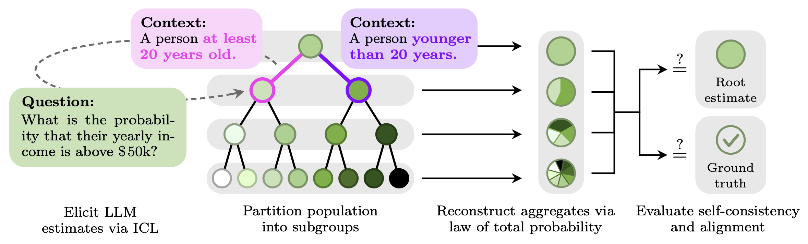

# Partition, Prompt, Aggregate: Statistical Self-Consistency in Language Models

[](https://arxiv.org/abs/2607.15277)
[](https://python.org/downloads/release/python-31311/)
<!-- [](https://pytorch.org/) -->
<!-- [](https://creativecommons.org/licenses/by-nc-nd/4.0/) -->
<!-- []() -->
<!-- []() -->

This repository implements the experiments accompanying the paper:

> [Partition, Prompt, Aggregate: Statistical Self-Consistency in Language Models](https://arxiv.org/abs/2607.15277)
> *by Patrik Wolf, Thomas Kleine Buening, Andreas Krause, Celestine Mendler-Dünner*

Please cite our work if you use this code, in full or in part, for your research (see [BibTeX below](#-citation)).

### 📚 Table of Contents

- [Introduction](#-introduction)
- [Experiment Domains](#-experiment-domains)
- [Quickstart](#-quickstart)
- [Configuration and Secrets](#-configuration-and-secrets)
- [Linting, Testing, and Type Checks](#-linting-testing-and-type-checks)
- [Citation](#-citation)

---

## 📖 Introduction

In-context learning is often interpreted as conditional inference: the prompt specifies a context, and the model’s 
output is treated as an estimate of the corresponding conditional distribution. But do LLM estimates actually 
behave like conditionals?

<p align="center">
   
</p>

We use binary conditioning trees to recursively partition a population into increasingly fine-grained subpopulations, 
elicit LLM estimates for each node, and aggregate them back to the population level via the law of total probability. 
Comparing these reconstructed aggregates against direct marginal estimates yields reference-free **self-consistency
checks**. Comparing them against survey statistics evaluates **alignment** with human data.

---

## 🌳 Experiment Domains

The self-consistency experiments are organized by data domain under `src/`:

- **ACS (`src/experiments_acs/`)**: income estimation tasks over the
  American Community Survey (via folktables).
- **Global Opinion QA (`src/experiments_global_opinion_qa/`)**: micro–macro experiments on
  subjective opinion questions across countries.
- **World Values Survey (`src/experiments_wvs/`)**: consistency and ground-truth alignment
  experiments on WVS answer distributions, plus synthetic forecasting tasks.

Each domain has a corresponding data loader package (`src/data_loader_acs/`,
`src/data_loader_global_opinion_qa/`, `src/data_loader_wvs/`) that handles preprocessing,
attribute dictionaries, and ground-truth prior computation.

---

## 🚀 Quickstart

#### 1. Create and activate a Python environment (Python 3.10+)

```bash
# Create a virtual environment
uv venv --python 3.13
source .venv/bin/activate
pyenv local 3.13.3
```

#### 2. Install dependencies

```bash
# Install build tools
python3 -m pip install --upgrade pip setuptools wheel

# Install dependencies with uv
uv pip install -e .
```

This installs the package in editable mode based on `pyproject.toml` and `requirements.txt`.

---

## 💾 Data

Download the data for the experiments:

- ACS: `src/data_loader_acs/data_to_parquet.py`, verify with `src/data_loader_acs/data_loader.py`
- WVS: download the WVS 7 SPSS dataset file from [WVS website](https://www.worldvaluessurvey.org) and place it in `data/wvs_wave_7/WVS_Cross-National_Wave_7_spss_v6_0.sav`, verify with `src/data_loader_wvs/data_loader.py`

---

#### 1. Create and activate a Python environment (Python 3.10+)

```bash
# Create a virtual environment
uv venv --python 3.13
source .venv/bin/activate
pyenv local 3.13.3
```

---

## 🔐 Configuration and Secrets

- **Secrets** (API keys) are stored in `secrets/secret_config.yaml`.
- Start from the template:

```bash
cp secrets/secret_template.yaml secrets/secret_config.yaml
```

Fill in the required keys (OpenAI, Gemini, OpenRouter) according to the models you plan to
query via `src/language_models/`.

> [!NOTE]
> Ensure that `secrets/secret_config.yaml` is included in your `.gitignore` to avoid
> accidentally committing sensitive information to version control.

---

## 📄 Linting, Testing, and Type Checks

This project is configured with `flake8`, `pytest`, and `mypy` (see `pyproject.toml`).
You can use `tox` to run common tasks:

```bash
# Run unit tests
tox -e py313

# Run linters
tox -e lint

# Run type checks
tox -e type
```

## 🎈 Citation

If you use this repository in your research, please cite the accompanying work:

```bibtex
@misc{wolf2026partitionpromptaggregatestatistical,
      title={Partition, Prompt, Aggregate: Statistical Self-Consistency in Language Models}, 
      author={Patrik Wolf and Thomas Kleine Buening and Andreas Krause and Celestine Mendler-Dünner},
      year={2026},
      eprint={2607.15277},
      archivePrefix={arXiv},
      primaryClass={cs.CL},
      url={https://arxiv.org/abs/2607.15277}, 
}
```
